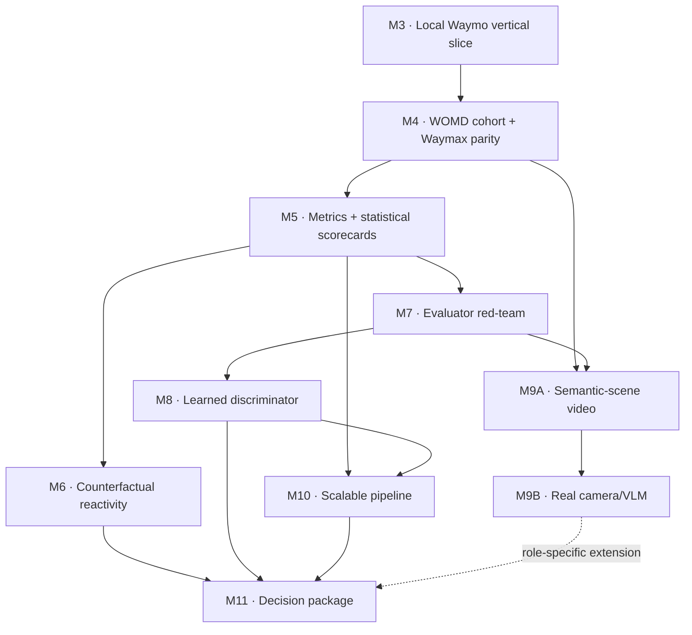

# EvalSim — Waymo-aligned roadmap

**Date:** 2026-07-28
**Status:** Canonical plan for M3 onward
**Supersedes:** The unfinished portion of
[`2026-07-27-evalsim-implementation-plan.md`](2026-07-27-evalsim-implementation-plan.md)

M0–M2 remain complete and unchanged. The old remaining sequence is retired because it
postponed WOMD, Waymax, and JAX until the end and reduced learned evaluation to a small
add-on. That would not provide convincing evidence for a simulation-evaluation role
centered on learned discriminators, evaluator validity, scalable ML systems, and
multimodal world-model evaluation.

## Operating principle

> Synthetic scenarios remain the controlled test bench; from M3 onward, every core
> feature must also have a real-WOMD acceptance path, and Waymax must be used repeatedly
> as a data model, execution backend, and independent semantic reference.

The contract-first architecture stays. EvalSim code outside adapters must not depend on
Waymax representations. Synthetic cases provide analytic oracles and known defects;
WOMD provides ecological validity; Waymax/JAX provide a domain-native reference path.

Local Apple Silicon CPU is the default development environment. JAX supports that path;
an accelerator is a measured scaling step, not a prerequisite for basic WOMD or Waymax
work.

## Current evidence boundary

- **Implemented:** contracts, lossless scenario/rollout serialization, deterministic
  synthetic scenarios, visualization, log replay, constant velocity, IDM, closed-loop
  world-agent rollout, and the M3 one-record WOMD → pinned Waymax/JAX → EvalSim local
  vertical slice. The Waymo-extra suite has 170 passing tests (the clean core-only path
  has 152); the additional real-data test is opt-in and passes against local shard
  `00000`.
- **Available locally for the next gate:** WOMD v1.3.1 TFExample validation shards
  `00000`–`00009`. Additional files in the directory must not silently expand the M4
  population.
- **Not yet implemented:** the M4 deterministic cohort/Waymax rollout parity, metrics,
  statistical scorecards, counterfactual ego control, evaluator stress tests, learned
  evaluators, multimodal/video/VLM evaluation, and a scalable resumable pipeline.

Plans and downloaded files do not count as implemented evidence.

## Milestone completion protocol

Every milestone uses the same nine-step workflow:

1. **Understand and pre-register:** inspect the baseline and lock the hypothesis, scope,
   falsification criteria, acceptance gates, risks, and non-goals.
2. **Plan:** write the implementation, verification, evidence, documentation, and
   rollback plan.
3. **Review the plan:** adversarially challenge architecture, semantics, leakage,
   feasibility, privacy, metric gaming, and claim risk.
4. **Execute:** implement incrementally behind typed seams with complete provenance.
5. **Verify and review execution:** run unit, contract, analytic-oracle, real-data, and
   independent-reference checks, then obtain an adversarial implementation review.
6. **Close documentation:** update the README, presentation, roadmap, claim ledger,
   limitations, mappings, and small permitted reproducibility metadata.
7. **Audit the release:** inspect tracked/staged content, archives, tests, site checks,
   privacy boundaries, and every public claim.
8. **Release:** make a milestone-scoped commit, push, and deploy without local-only
   artifacts.
9. **Verify after release:** confirm the remote commit, deployed site/health, and public
   evidence boundary.

Raw data, converted data, model checkpoints, caches, run outputs, and generated
experiment artifacts remain local-only. Commit only code, tests, schemas, small
manifests/checksums, and sanitized documentation permitted by `AGENTS.md`.

## Replacement milestones

### M3 — Local Waymo vertical slice

**Status:** ✅ Implemented and accepted locally on 2026-07-28; release verification
remains pending and is tracked in the milestone execution plan until the post-release
gate completes.

**Question:** Can one real scenario travel through
WOMD TFRecord → Waymax/JAX → EvalSim contract → local Parquet → visualization without
semantic loss at the fields we intentionally support?

**Build**

- Add a pinned optional Waymo environment for JAX, TensorFlow, and a fixed Waymax
  revision. Do not depend on a floating branch.
- Add a local compatibility smoke command that records Python, package, backend, device,
  and dataset-schema versions.
- Implement `WaymaxSource` behind the existing source boundary.
- Map scenario identity, SDC identity, observation/future boundary, agent identity/type,
  validity, dimensions, pose/velocity, roadgraph geometry, and source lineage.
- First produce a field-by-field schema map. Add source-neutral typed context for object
  roles, traffic lights, routes, or richer map semantics only where a downstream
  milestone requires it; do not hide tensor payloads in JSON metadata.
- Preserve future camera or sensor data as a separate sidecar keyed by scenario ID rather
  than placing media tensors in the motion contract.

**Evidence gate**

- One scenario from shard `00000` loads on the local Apple Silicon CPU.
- `current_index` is derived from the locked Waymax/WOMD configuration, not a magic
  number.
- Conversion is deterministic and the contract plus Parquet round-trip tests pass.
- EvalSim and Waymax views agree on scenario/SDC identity, agent count, supported
  horizon, valid masks, and map placement.
- The full Waymo-extra suite passes 170 tests; the separately opted-in real-data integration
  test also passes.
- No real-data golden fixture or converted payload is committed; regular CI uses
  synthetic Waymax-shaped fixtures, while a marked local integration test reads the
  ignored TFRecord.

**Accepted evidence:** exact shard `00000` was decoded locally; the pre-registered
earliest eligible record passed native-identity, SDC, time-boundary, agent/mask,
supported-trajectory, dimension, retained-map, provenance, deterministic conversion,
Parquet, visualization, log-replay, CV, IDM-vehicle-branch, and JAX CPU `jit` checks.
Only sanitized booleans and runtime/version facts are publishable; the selected record,
native identity, coordinates, image, and converted payload remain ignored and local.

**Claim unlocked after acceptance:** integrated one local WOMD v1.3.1 scenario through
pinned Waymax/JAX into a validated simulator-neutral EvalSim contract on Apple Silicon
CPU.

### M4 — Deterministic WOMD cohort and Waymax parity

**Question:** Does the one-scene adapter scale to an auditable population, and where do
EvalSim and Waymax semantics agree or diverge?

**Build**

- Select exactly shards `00000`–`00009`; never glob every file present.
- Generate a deterministic manifest containing shard suffix, record ordinal, scenario
  ID, adapter/schema version, eligibility or rejection reason, and permitted checksums.
- Freeze a parity cohort of 128 eligible scenarios using a declared selection rule
  before comparing policies. If the eligibility scan cannot supply 128, record the rule
  and use the complete eligible population without replacement.
- Run EvalSim log replay, CV, and IDM plus supported Waymax log-playback/reference
  dynamics and route-aware IDM paths on the same eligible scenes.
- Convert Waymax outputs back to the `Rollout` contract.
- Exercise real `jax.jit` and `vmap` paths. Measure compilation separately from
  steady-state execution.
- Write a semantic crosswalk for coordinates, masks, agent control, initialization
  horizon, overlap/offroad/wrong-way/route definitions, and tolerance choices.

**Evidence gate**

- Every selected record converts or has a classified rejection; silent drops are zero.
- Log-replay parity holds on eligible agents and frames.
- SDC, agent ordering, validity, map frame, and time boundary survive batching.
- All backend discrepancies are reproduced and explained; Waymax is an independent
  reference, not unquestioned ground truth.
- CPU compilation time, warm throughput, peak memory, and exact version provenance are
  recorded locally.

**Claim unlocked after acceptance:** cross-validated EvalSim rollouts against Waymax on
an auditable WOMD cohort.

### M5 — Real-WOMD metric system and statistical scorecards

**Question:** Can independent metrics expose materially different simulator failures on
real scenes without hiding uncertainty or collapsing realism into one score?

**Build**

- Implement the metric registry and per-scenario local result store.
- Kinematics: speed, acceleration, jerk, yaw rate, feasibility, and distributional log
  divergence.
- Interaction: overlap/collision, minimum distance, TTC, headway, and response latency
  where eligible.
- Map/route: offroad, wrong-way, lane distance, route progress, and condition adherence
  where the source provides a condition.
- Temporal consistency: discontinuities, lifecycle flicker, and implausible state
  changes. These are motion-domain analogues, not camera-video metrics.
- Validate custom definitions with analytic synthetic oracles and cross-check overlapping
  definitions against Waymax.
- Pre-register WOMD slices for density, modeled-object count, vulnerable-road-user
  presence, low TTC, maneuver/context proxies, signalization, and validity quality.
- Add paired per-scenario effects, scenario-cluster bootstrap confidence intervals,
  effect sizes, eligibility/missingness counts, small-slice warnings, and exploratory
  multiple-testing controls.

**Evidence gate**

- All three EvalSim policies and at least one Waymax path run over the frozen cohort.
- Every metric publishes its unit, direction, eligibility, invalid reasons, and retained
  component distribution.
- Scorecards show paired effects and 95% confidence intervals; null and contradictory
  results are retained.
- Equivalent Waymax/custom metrics meet documented tolerances or have an explained
  semantic mismatch.
- No headline composite realism score is introduced.

**Claim unlocked after acceptance:** built a sliced simulation-realism evaluation
framework on WOMD with paired scenario-level uncertainty.

### M6 — Counterfactual closed-loop reactivity

**Question:** What happens when ego leaves the logged future, and can the evaluation
separate nonreactivity from unsafe or overly conservative reaction?

**Build**

- Select WOMD scenes using explicit perturbation eligibility.
- Add typed, versioned ego interventions: braking, delayed acceleration, stop duration,
  lateral offset, and timing changes.
- Run paired baseline/counterfactual experiments from identical initial state, seed,
  policy, and horizon.
- Compare log playback, custom IDM, supported Waymax route-aware IDM, and both rollout
  backends on the parity cohort where semantics match.
- Measure response latency, following acceleration change, TTC/minimum-distance change,
  collisions avoided or introduced, progress loss, and response smoothness.

**Evidence gate**

- Tests prove no logged-future leakage into causal policies.
- Synthetic oracles establish the expected causal direction before real-data analysis.
- Severity is monotonic where the intervention definition implies monotonicity.
- Real-WOMD results include paired intervals and eligibility counts.
- Nonreactivity and overreaction are independently detectable.
- Engine/backend disagreements remain visible and explained.

**Claim unlocked after acceptance:** designed counterfactual closed-loop reactivity
evaluation over WOMD using Waymax and typed ego interventions.

### M7 — Evaluator red-team and metric governance

**Question:** Do the evaluators detect known defects for the right reason, and what do
they miss or falsely flag?

**Build**

- Add severity-controlled defects: frozen/nonreactive agents, teleportation, jerk/yaw
  spikes, infeasible motion, overlap, offroad/wrong-way motion, collapse, excessive
  dispersion, route/condition violation, and identity/mask/coordinate bugs.
- Include invariance probes for agent order, padding, global translation/rotation, and
  serialization.
- Create a metric card for every evaluator: intended use, statistical unit, eligibility,
  invariances, expected sensitivity, blind spots, calibration population, threshold
  rationale, version, and owner.
- Select thresholds on calibration defects and evaluate them on held-out defect families.

**Evidence gate**

- Release-candidate metrics pass identity, invariance, and expected-direction tests.
- Detection is measured across severity curves, not one hand-picked example.
- The data-derived detection matrix includes false positives, false negatives, and
  confidence intervals.
- At least one plausible metric is shown to be misleading.
- The adversarial review finds no trivial provenance, padding, or preprocessing shortcut.

**Claim unlocked after acceptance:** developed a severity-calibrated metric stress suite
that exposed evaluator blind spots.

### M8 — JAX/Flax learned realism discriminator

**Question:** Can a learned evaluator generalize beyond the simulator fingerprints and
defect families it saw during training?

**Data gate:** the current local files are validation shards. Before model fitting,
download a small deterministic set of WOMD **training** shards and retain the current
validation cohort as held-out data. If that is not done, label the work a development
experiment rather than a held-out benchmark.

**Build**

- Tensorize context and futures from Waymax: motion tokens, validity/type masks,
  interaction features, and map/route context.
- Establish logistic/boosted baselines, then implement a modest Flax temporal-interaction
  encoder.
- Use logged WOMD futures as real samples and policy rollouts plus controlled defects as
  negative samples.
- Group all examples from one source scenario into one partition.
- Hold out an entire simulator or corruption family to test evaluator generalization.
- Remove trivial shortcuts: no IDs/provenance, identical preprocessing and horizons,
  balanced masks, and no serialization differences.
- Add calibration, model/checkpoint provenance, feature/model ablations, per-slice
  analysis, and disagreements with hand-designed metrics.

**Evidence gate**

- Automated tests prove source-scenario partition disjointness.
- Report AUROC, AUPRC, Brier/ECE, uncertainty, per-slice performance, and
  generator-held-out performance.
- High in-distribution accuracy is not accepted without out-of-distribution evidence.
- At least one learned/hand-metric disagreement receives qualitative root-cause
  analysis.
- Local `jit`/`vmap` execution is real and reproducible; any accelerator claim requires
  an actual measured run.
- An honest negative result is acceptable.

**Claim unlocked after acceptance:** trained and calibrated a Flax temporal realism
discriminator on WOMD/Waymax rollouts with scenario-grouped and generator-held-out
evaluation.

Do not call this a large-scale discriminator pipeline until measured scale justifies the
phrase.

### M9 — Multimodal, video, and VLM evaluation bridge

This is the largest role-specific gap. WOMD motion TFExamples contain trajectories,
roadgraph, lights, and paths—not camera pixels. A top-down raster animation must never
be described as camera or sensor realism.

#### M9A — Semantic-scene video lab

- Render synchronized Waymax BEV sequences from logged and simulated motion scenes.
- Inject controlled frame drop/shuffle, temporal flicker, geometric drift,
  agent-map inconsistency, and route-condition violations.
- Evaluate temporal stability, geometry, trajectory/render consistency, and condition
  following.
- Label every artifact and claim as **BEV semantic-scene** evaluation.

#### M9B — Real camera/VLM lab

- After a schema, licensing, storage, and compute spike, choose one small additional
  source of paired camera/geometry data. Prefer a bounded Waymo Perception or End-to-End
  subset if practical.
- Run an open-weight video/VLM evaluator locally or in a controlled compute environment;
  never send Waymo frames to an external model API.
- Use structured prompts with randomized paired ordering.
- Validate VLM judgments against blinded known-corruption labels and deterministic
  geometry/temporal checks.
- Measure prompt sensitivity, positional bias, agreement, and failure cases. A VLM is
  never the sole ground truth or release gate.

**Evidence gate**

- At least four corruption families have severity curves.
- M9A remains explicitly semantic/BEV.
- No camera/video/VLM résumé claim is unlocked until M9B uses real camera sequences.
- A blinded audit quantifies evaluator agreement and bias.
- At least one VLM/geometric-metric disagreement is analyzed.

**Claim unlocked after M9B only:** prototyped a validated video/VLM evaluator on real
driving sensor sequences across temporal, geometric, multimodal, and
condition-following defects.

### M10 — Scalable and resumable evaluation pipeline

**Question:** Can the same experiment be reproduced, resumed, audited, and scaled without
pretending a laptop run is production deployment?

**Build**

- Config-driven CLI and immutable run manifests.
- Deterministic TFRecord selection and scenario/model partitions.
- Streaming decode, bounded prefetch, content-addressed caching, checkpoint/resume, and
  failed-scenario retry.
- Local executor plus one real cloud accelerator or batch path if budget is available.
- Fault injection: interrupt a run mid-shard, resume, and prove no duplication or loss.
- Record compile time, warm throughput, memory, accelerator utilization, cost, and cache
  speedup.
- Write an architecture RFC for full-scale motion and video evaluation: storage layout,
  backpressure, failure domains, data quality, observability, evaluator/model registry,
  and release gates.

**Evidence gate**

- One command runs a deterministic subset from a clean checkout when local data is
  present.
- Interrupted runs resume exactly.
- Every result traces to source manifest, simulator, perturbation, evaluator/model,
  commit, environment, and seed.
- Local and any cloud throughput/cost claims are measured.
- Do not use multi-device or production-scale language unless it was actually executed.

**Claim unlocked after acceptance:** built a resumable, manifest-driven JAX evaluation
pipeline and measured its local and accelerator cost/performance.

### M11 — Decision package and staff-caliber communication

**Purpose:** Turn implementation into defensible evidence and demonstrate engineering
judgment rather than a feature checklist.

**Deliver**

- Architecture RFC with rejected alternatives.
- Metric-governance and release-decision memo.
- Data/ML risk register and evaluator-validation report.
- Curated failure analyses and explicit negative results.
- Updated claim-to-evidence ledger.
- Ten-minute demo and a 30–45 minute system-design narrative.
- Five reusable stories: integration decision, semantic discrepancy, metric failure,
  leakage/generalization, and scaling tradeoff.
- A team execution plan covering ownership boundaries, review gates, experiment
  standards, and mentoring approach.
- Clear limitations: no production deployment, no large generative-model training, and
  no sensor-video claim unless M9B is complete.

The solo project can demonstrate architecture and technical direction. Mentoring and
organizational leadership claims must come from real professional experience, not from
this repository.

## Dependency map

M7 is revisited after M8 and M9 so learned and VLM evaluators enter the same conformance
suite.

## Stop lines

| Package | Required milestones | Honest result |
|---|---|---|
| Real Waymo foundation | M3–M4 | WOMD, Waymax, and JAX are used substantively |
| Strong trajectory evaluator | M3–M8 | Real-data metrics, causal reactivity, evaluator red-team, learned discriminator |
| Role-specific multimodal bridge | M9A–M9B | Validated semantic-video and real camera/VLM evaluator evidence |
| Staff-caliber systems package | M10–M11 | Measured scale path, reliability, release reasoning, and communication |

If time is constrained, protect M3, M4, M7, and M8. Reduce metric breadth before
removing evaluator validation.

## Explicit scope cuts

- Do not train a diffusion, flow, or world model solely to decorate the project; evaluate
  models and simulation outputs.
- Do not process all 150 validation shards before the fixed ten-shard pipeline is correct
  and profiled.
- Do not add C++ without profiling evidence or a concrete interview need.
- Do not build fake distributed infrastructure.
- Do not use a single realism score.
- Do not treat Waymax or a VLM as unquestioned ground truth.
- Do not call BEV animation camera/video realism.
- Do not upload or commit Waymo data, converted payloads, model checkpoints, or generated
  experiment artifacts.

## Additional inputs needed later

Nothing else is required to begin M3. Later gates require:

- a small fixed set of WOMD training shards before M8;
- one bounded camera/geometry source and an approved local/open-weight VLM before M9B;
- a modest cloud-compute budget only if an accelerator benchmark is pursued in M8/M10.
