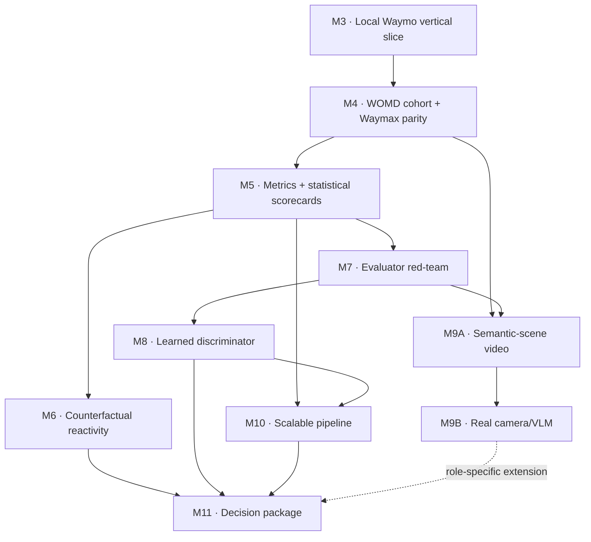

# EvalSim — Waymo-aligned roadmap

**Date:** 2026-07-30
**Last evidence update:** 2026-07-30
**Status:** Canonical plan for M3 onward
**Supersedes:** The unfinished portion of
[`2026-07-27-evalsim-implementation-plan.md`](2026-07-27-evalsim-implementation-plan.md)

M0–M2 remain complete and unchanged. The old remaining sequence is retired because it
postponed WOMD, Waymax, and JAX until the end and reduced learned evaluation to a small
add-on. That would not provide convincing evidence for a simulation-evaluation role
centered on learned discriminators, evaluator validity, scalable ML systems, and
multimodal world-model evaluation.

## Operating principle

> Synthetic scenarios remain the controlled test bench; from M3 onward, every core
> feature must also have a real-WOMD acceptance path, and Waymax must be used repeatedly
> as a data model, execution backend, and separately implemented domain-native
> semantic reference with an explicit shared-decode limitation.

The contract-first architecture stays. EvalSim code outside adapters must not depend on
Waymax representations. Synthetic cases provide analytic oracles and known defects;
WOMD provides real-scene domain context; Waymax/JAX provide a domain-native reference
path.

Local Apple Silicon CPU is the default development environment. JAX supports that path;
an accelerator is a measured scaling step, not a prerequisite for basic WOMD or Waymax
work.

## Current evidence boundary

- **Implemented:** contracts, lossless scenario/rollout serialization, deterministic
  synthetic scenarios, visualization, log replay, constant velocity, IDM, closed-loop
  world-agent rollout, and the M3 one-record WOMD → pinned Waymax/JAX → EvalSim local
  vertical slice. M4 is also implemented, locally accepted, and released: an auditable
  complete-case conditional cohort from exactly ten validation shards passed
  supported-field, exact-log, rollout-contract, bounded Waymax-reference, and batched
  JAX CPU gates. M5 is also implemented and accepted: 13 registered motion metrics, 8
  source-only slices, paired finite-cohort scorecards, a schema- and hash-bound
  immutable result store, deterministic reporting, fail-closed accepted-M4 reuse, and
  bounded native Waymax parity ran over the unchanged 128-case cohort. The official
  result passed exact 6,656/1,024/312/144 row-domain verification, deterministic
  scorecard re-derivation, and independent semantic, statistical, and privacy/claim
  reviews. M6 now has a
  [portable data-free implementation checkpoint](2026-07-29-m6-data-free-implementation-checkpoint.md):
  its contract, access-control, typed-plan, synthetic-oracle, bounded Waymax, and
  guarded-store foundations are implemented. Its capture-first official verifier/CLI,
  runtime/source authority, and two-step result-review lifecycle have also completed a
  fresh independent adversarial security review with no P0--P2 blockers. This accepts
  the implementation boundary only; it does not accept a scientific M6 result. The
  latest recorded full-suite result before final result-store hardening remains 1,173
  passing tests and one expected local-data skip pending the current full-suite record.
- **Available locally:** WOMD v1.3.1 TFExample validation shards `00000`–`00009`.
  Additional files in the directory do not expand the frozen M4 population.
- **Not yet accepted:** the M6 eligibility scan, compute pilot, WOMD/Waymax outcome
  execution, live determinism evidence, sealed result, three-role result review, and
  result claim; evaluator stress tests; learned evaluators; multimodal/video/VLM
  evaluation; and a scalable resumable pipeline. M5 supports fixed-cohort metric
  comparisons, but not an overall policy winner, simulator superiority,
  WOMD-population inference, or production-readiness claim.

Plans and downloaded files do not count as implemented evidence. M5's accepted
aggregate result applies only to its frozen complete-case conditional cohort and
pre-registered metric semantics.

## Milestone completion protocol

Every milestone uses the same nine-step workflow:

1. **Understand and pre-register:** inspect the baseline and lock the hypothesis, scope,
   falsification criteria, acceptance gates, risks, and non-goals.
2. **Plan:** write the implementation, verification, evidence, documentation, and
   rollback plan.
3. **Review the plan:** adversarially challenge architecture, semantics, leakage,
   feasibility, privacy, metric gaming, and claim risk.
4. **Execute:** implement incrementally behind typed seams with complete provenance.
5. **Verify and review execution:** run unit, contract, analytic-oracle, real-data, and
   independent-reference checks, then obtain an adversarial implementation review.
6. **Close documentation:** update the README, presentation, roadmap, claim ledger,
   limitations, mappings, and small permitted reproducibility metadata.
7. **Audit the release:** inspect tracked/staged content, archives, tests, site checks,
   privacy boundaries, and every public claim.
8. **Release:** make a milestone-scoped commit, push, and deploy without local-only
   artifacts.
9. **Verify after release:** confirm the remote commit, deployed site/health, and public
   evidence boundary.

Raw data, converted data, model checkpoints, caches, run outputs, and generated
experiment artifacts remain local-only. Commit only code, tests, schemas, small
manifests/checksums, and sanitized documentation permitted by `AGENTS.md`.

## Replacement milestones

### M3 — Local Waymo vertical slice

**Status:** ✅ Implemented, accepted, released, and post-release verified on 2026-07-28.

**Question:** Can one real scenario travel through
WOMD TFRecord → Waymax/JAX → EvalSim contract → local Parquet → visualization without
semantic loss at the fields we intentionally support?

**Build**

- Add a pinned optional Waymo environment for JAX, TensorFlow, and a fixed Waymax
  revision. Do not depend on a floating branch.
- Add a local compatibility smoke command that records Python, package, backend, device,
  and dataset-schema versions.
- Implement `WaymaxSource` behind the existing source boundary.
- Map scenario identity, SDC identity, observation/future boundary, agent identity/type,
  validity, dimensions, pose/velocity, roadgraph geometry, and source lineage.
- First produce a field-by-field schema map. Add source-neutral typed context for object
  roles, traffic lights, routes, or richer map semantics only where a downstream
  milestone requires it; do not hide tensor payloads in JSON metadata.
- Preserve future camera or sensor data as a separate sidecar keyed by scenario ID rather
  than placing media tensors in the motion contract.

**Evidence gate**

- One scenario from shard `00000` loads on the local Apple Silicon CPU.
- `current_index` is derived from the locked Waymax/WOMD configuration, not a magic
  number.
- Conversion is deterministic and the contract plus Parquet round-trip tests pass.
- EvalSim and Waymax views agree on scenario/SDC identity, agent count, supported
  horizon, valid masks, and map placement.
- The current full Waymo-extra suite passes 493 tests with one expected local-data
  skip; the core-only suite passes 418 with 22 expected optional-runtime skips. The
  separately opted-in M3 integration passed at M3 acceptance, and M4 now has its own
  standalone local-data acceptance.
- No real-data golden fixture or converted payload is committed; regular CI uses
  synthetic Waymax-shaped fixtures, while a marked local integration test reads the
  ignored TFRecord.

**Accepted evidence:** exact shard `00000` was decoded locally; the pre-registered
earliest eligible record passed native-identity, SDC, time-boundary, agent/mask,
supported-trajectory, dimension, retained-map, provenance, deterministic conversion,
Parquet, visualization, log-replay, CV, IDM-vehicle-branch, and JAX CPU `jit` checks.
Only sanitized booleans and runtime/version facts are publishable; the selected record,
native identity, coordinates, image, and converted payload remain ignored and local.

**Claim unlocked after acceptance:** integrated one local WOMD v1.3.1 scenario through
pinned Waymax/JAX into a validated simulator-neutral EvalSim contract on Apple Silicon
CPU.

**Release record:** implementation commit `94541a2` is on GitHub `main`, and the exact
source state was deployed as owner-only presentation version 4. Dataset and derived
artifacts remained local and ignored.

### M4 — Deterministic WOMD cohort and Waymax parity

**Status:** ✅ Implemented, accepted, released, and post-release verified on 2026-07-28.

**Question:** Does the one-scene adapter scale to an auditable population, and where do
EvalSim and Waymax semantics agree or diverge?

**Build**

- Select exactly shards `00000`–`00009`; never glob every file present.
- Generate a deterministic manifest containing shard suffix, record ordinal, scenario
  ID, adapter/schema version, eligibility or rejection reason, and permitted checksums.
- Freeze a parity cohort of 128 eligible scenarios using a declared selection rule
  before comparing policies. If the eligibility scan cannot supply 128, record the rule
  and use the complete eligible population without replacement.
- Run EvalSim log replay, CV, and IDM plus supported Waymax exact log-playback/reference
  dynamics on the full cohort. Run Waymax's privileged logged-trajectory
  waypoint-following IDM on a pre-registered nested subset and horizon that fit the
  measured local CPU budget.
- Convert Waymax outputs back to the `Rollout` contract.
- Exercise real `jax.jit` and `vmap` paths. Measure compilation separately from
  steady-state execution.
- Write a semantic crosswalk for coordinates, masks, agent control, initialization
  horizon, overlap/offroad/wrong-way/route definitions, and tolerance choices. M4
  documents metric semantics; numerical custom/Waymax metric parity begins in M5.

**Evidence gate**

- Every raw record is counted before preprocessing; only pre-registered source-property
  exclusions may reject. Every source-eligible record converts and passes independent
  parity, or M4 fails. Silent drops are zero.
- Log-replay parity holds on eligible agents and frames.
- SDC, agent ordering, validity, map frame, and time boundary survive batching.
- All supported-matrix discrepancies are reproduced and explained. Waymax is a pinned
  semantic reference that shares the decode path, not independent ground truth.
- CPU compilation time, warm throughput, peak memory, and exact version provenance are
  recorded locally.

**Accepted evidence:** exactly shards `00000`–`00009` contained 2,916 raw records.
The frozen supported-map complete-case predicate classified 1,527 as eligible and
1,389 as `source_no_supported_map`, meaning no roadgraph group met the frozen strict
predicate—not that those records contained no map data. The deterministic selector
chose 128 with no quota deficit, redistribution, or fallback. Scan-time
adapter/independent parity gates passed,
and the selected full cohort passed direct exact-log oracles, 80-transition reference
conversion, and 80-transition EvalSim log-replay, constant-velocity, and IDM execution.
The privileged logged-trajectory waypoint-following Waymax IDM reference was limited
as pre-registered to 16 scenes × 20 transitions and repeated deterministically; its
separate JIT gate covered one scene.

The fresh-worker batch-two JAX CPU exact-log microbenchmark used 20 warm runs and
recorded 217.983625 ms compilation, 1.897854 ms median, 2.617709 ms nearest-rank
empirical p95, and 1,053.821843 scenarios/s at the median. Process peak RSS was
587,808,768 bytes; that value is a process high-water mark, not JAX device memory. The
focused M4 CLI suite passed 110 tests, the locked M4 matrix passed 421 with one
local-data skip, the full Waymo-extra suite passed 493 with one local-data skip, and
the core-only suite passed 418 with 22 optional-runtime skips.

**Limitations:** this is a deterministic complete-case conditional sample from the
first ten validation shards, not a random or representative WOMD benchmark. EvalSim
and the reference path share the pinned Waymax WOMD decode, so the cross-check is not
fully independent. The benchmark measures the narrow batch-two exact-log kernel, not
end-to-end cohort throughput or production scale. M4 itself did not compute custom
realism metrics, behavioral slices, uncertainty, policy rankings, or custom/Waymax
metric parity; those were completed later under the separate M5 evidence gate.

**Claim unlocked after acceptance:** cross-checked exact log-playback mapping and
rollout-contract semantics against pinned Waymax/JAX on an auditable complete-case
conditional WOMD cohort.

**Release record:** evidence-closure commit `9e4012d` is on GitHub `main`, and that
exact source state was deployed through the existing owner-only presentation as
version 6. Raw data and all generated experiment artifacts remained local and ignored.

### M5 — Real-WOMD metric system and statistical scorecards

**Status:** ✅ Accepted on 2026-07-29 after the bound real-WOMD/Waymax execution,
result-store verification, and independent result reviews. The
[`accepted M5 pre-registration`](2026-07-28-m5-real-womd-metrics-scorecards.md)
governed the execution; the complete publication-safe result is in the
[`M5 official acceptance report`](../results/m5-official-acceptance.md).

The accepted data-free boundary contains 13 registered metrics, 8 source-only slices,
the complete 13 × 8 × 3 paired-scorecard ledger, deterministic scenario-resampling
statistics with small/sparse suppression, an immutable Parquet result store with
schema/hash/row validation and scorecard re-derivation, a deterministic aggregate
renderer, fail-closed accepted-M4 reuse verification, and a fixed five-scenario
synthetic CLI. That CLI produces 195 metric rows, 40 slice rows, 312 scorecard rows,
25 exact log-replay zero oracles, and zero Waymax-parity rows.

The accepted official boundary adds a one-pass 128-case evaluator, a separate Waymax
exact-log reference role, a source-only 16-case parity selector, native parity
adapters, pre-metric parity-order and post-evaluation determinism receipts, exact
result-store verification, exhaustive source/Git/data/M4/output binding, and a bounded
terminal lifecycle. It enforces exact official domains of 6,656 metric rows, 1,024
slice rows, 312 scorecard rows, and 144 parity-summary rows.

Software verification includes 14 runner tests, a public mocked 128-case lifecycle,
18 injected failure boundaries, 34 adversarial lifecycle cases, the full repository
suite with 876 passing tests and one expected local-data skip, and final adversarial
**ACCEPT**. The subsequent official execution consumed the exact 128 accepted M4 cases
from shards `00000`–`00009`, produced the required 6,656 metric, 1,024 slice, 312
scorecard, and 144 parity-summary rows, and passed exact store re-verification and
three independent result-review tracks.

**Question:** Can separately reported metrics expose materially different simulator
failures on the frozen real-scene cohort without hiding scene-level variation or
collapsing motion quality into one score?

**Accepted implementation and execution**

- The metric registry and per-scenario local result store consume only project
  contracts.
- Kinematics: speed, acceleration, jerk, yaw rate, feasibility, and distributional log
  divergence.
- Interaction: overlapping-target-frame rate, minimum center distance, and a capped
  constant-velocity TTC proxy. Lane headway and response latency require stronger
  lane/reactivity context and are deferred to M6.
- Map/route: implement clearly named lane-proximity and lane-heading diagnostics from
  retained 2-D contract geometry. Native offroad, path-distance, route, signal, and
  condition semantics require typed context absent from the current contract and move
  to the M6 context/ego-control design; do not reuse misleading upstream names for
  approximations.
- Temporal consistency: discontinuities, lifecycle flicker, and implausible state
  changes. These are motion-domain analogues, not camera-video metrics.
- Custom definitions are validated with analytic synthetic oracles. The official run
  also cross-checked logged-position divergence, overlap, and fixed-step kinematic
  infeasibility against pinned Waymax on the frozen bounded parity subset.
- Source-only slices cover current density, a clearly labeled retained-world
  count proxy, vulnerable-road-user presence, current low-TTC proxy, observed ego
  maneuver, future lifecycle change, and retained-lane availability. Signalization is
  deferred because the current contract lacks its typed timeline.
- Exact paired finite-cohort effects, deterministic scenario-resampling stability
  bands, effect sizes, eligibility/missingness counts, small/sparse warnings, a fixed
  complete comparison ledger, and adjusted primary stability bands are implemented.
  Fixed-cohort resampling is not presented as WOMD-population confidence, and the
  implementation does not generate exploratory significance claims.
- The official CLI streams each accepted M4 member exactly once through the three
  policy roles and separate exact-log reference, retaining only bounded cross-case
  facts before deterministic scorecard finalization.
- The official store fails closed on source, Git, shard, accepted-M4, output,
  determinism, parity, terminal, schema, row-domain, or hash drift. A failed ignored
  run is preserved and cannot be promoted to success in place.

**Accepted result and limitations**

- All 12 pre-registered primary `all`-slice cells retained paired `n = 128`; all 312
  scorecards were independently reconstructed, with no policy-dependent asymmetric
  missingness.
- Native parity reported zero tolerance failures across 38,754 logged-position
  components, zero binary mismatches across 38,754 overlap components, and zero binary
  mismatches across 37,770 fixed-step kinematic components. Logged-position parity is
  tolerance-bounded rather than bit-exact.
- Ten of 12 multiplicity-adjusted primary stability bands exclude zero. Different
  metric families nevertheless favor different policies, and the remaining two cells
  do not support an adjusted direction; no overall winner or total ordering is
  defensible.
- The only metric ineligibility was symmetric `no_supported_lane` for the two neutral
  lane diagnostics. The empty observed-ego-turn slice remained in the ledger as
  `insufficient_n`.
- The bands are deterministic scene-reweighting sensitivity summaries for this fixed
  cohort, not confidence intervals, hypothesis tests, or WOMD-population inference.
  EvalSim and the reference share the Waymax decode, ego remains logged/exogenous, log
  replay is privileged, and the fixed `0.1 s` kinematic measure is a semantic
  diagnostic rather than a physical-time-normalized feasibility measure.
- No headline composite score, winner, causal conclusion, production claim,
  offroad/route/signal claim, or simulator-superiority conclusion was introduced.

**Claim unlocked after acceptance:** built a sliced motion-simulation evaluation
framework on a locally auditable complete-case conditional WOMD cohort, with paired
scenario-resampling stability analysis and pinned Waymax semantic cross-checks; this
does not imply WOMD-population or simulator-superiority evidence. M6 implementation is
now in progress under its accepted outcome-blind pre-registration.

### M6 — Counterfactual closed-loop reactivity 🚧

**Accepted pre-registration:** [exact M6 v1 scope](2026-07-29-m6-counterfactual-reactivity.md).
**Implementation checkpoint:** [portable data-free state and exact resume
sequence](2026-07-29-m6-data-free-implementation-checkpoint.md).
The official verifier/CLI and its capture-first authority boundary have completed
independent adversarial security review with no P0--P2 blockers. M6 nevertheless
remains in progress: no WOMD eligibility count or policy outcome has been opened, no
live determinism receipt or sealed result exists, and no scientific result is accepted.
The reviewed lifecycle is eligibility-only → outcome-suppressed compute pilot →
official execution ending at `AWAITING_REVIEW` → separate three-role
`finalize-review`.

**Question:** What happens when ego leaves the logged future, and can the evaluation
separate nonreactivity from a deliberately costly simulated response?

**Build**

- Enforce separate history-only and privileged policy initialization capabilities;
  history-only built-ins receive observed history/static context and then only realized
  current state.
- Add a typed identity control and one source-templated longitudinal-braking family:
  primary positive deceleration magnitude `b=2.0 m/s²` and a complete secondary
  `b=4.0 m/s²` severity view.
- Run source-eligible paired 40-transition NumPy experiments for privileged log replay,
  history-only constant velocity, and history-only EvalSim IDM.
- Use Waymax on a source-ranked, exact-cadence 20-transition subset as a logged-world
  executor and privileged logged-trajectory waypoint-following IDM reference, with
  same-scene NumPy views. Do not describe it as causal, map-route-aware, independent
  ground truth, or a numerical twin of EvalSim IDM.
- Keep additional delayed-acceleration, stop/hold, lateral-offset, and arc-time-warp
  families deferred until they receive separate formulas, eligibility, budgets, and
  outcome-blind review.

**Evidence gate**

- Tests enforce the history-only data-flow boundary, preserve the full-length legacy
  no-plan path, and prove the synchronous earliest-response floor.
- Independent analytic oracles validate sham identity, braking equations, feasibility,
  nested severity, nonresponse, response, and deliberately costly response.
- Every accepted M4 scene receives one outcome-independent eligibility disposition;
  every accepted analysis scene remains completely paired.
- Four separate response/reactivity measures retain null, sparse, adverse, and
  contradictory results under pre-registered finite-cohort reweighting summaries.
- Real-WOMD and bounded Waymax paths pass their declared identity, lifecycle, control,
  cadence, tolerance, determinism, privacy, and publication gates.

**Claim unlocked only after result acceptance:** implemented and evaluated one typed
paired ego-braking intervention on a fixed source-eligible subset of the local WOMD
cohort, with audited history-only policies and explicitly privileged log-replay,
ego-plan, and Waymax references. This will not imply real-traffic causality, safety,
simulator superiority, or evaluator validity beyond the registered measures.

### M7 — Evaluator red-team and metric governance 🚧 (data-free foundation implemented)

The data-free M7 foundation is implemented and verified in `evalsim/stress/` (defect
framework + frozen-agent/teleportation/overlap families with analytic oracles, a detection
matrix, metric governance cards, and the required blind-spot negative result: the
kinematic-infeasibility rate misses frozen/nonreactive agents). 26 oracle tests,
adversarially subagent-reviewed. The invariance harness, calibration/held-out split,
broader taxonomy, and the WOMD detection matrix remain pending. Pre-registration + status:
[M7 evaluator red-team](2026-07-31-m7-evaluator-red-team.md).

**Question:** Do the evaluators detect known defects for the right reason, and what do
they miss or falsely flag?

**Build**

- Add severity-controlled defects: frozen/nonreactive agents, teleportation, jerk/yaw
  spikes, infeasible motion, overlap, offroad/wrong-way motion, collapse, excessive
  dispersion, route/condition violation, and identity/mask/coordinate bugs.
- Include invariance probes for agent order, padding, global translation/rotation, and
  serialization.
- Create a metric card for every evaluator: intended use, statistical unit, eligibility,
  invariances, expected sensitivity, blind spots, calibration population, threshold
  rationale, version, and owner.
- Select thresholds on calibration defects and evaluate them on held-out defect families.

**Evidence gate**

- Release-candidate metrics pass identity, invariance, and expected-direction tests.
- Detection is measured across severity curves, not one hand-picked example.
- The data-derived detection matrix includes false positives, false negatives, and
  confidence intervals.
- At least one plausible metric is shown to be misleading.
- The adversarial review finds no trivial provenance, padding, or preprocessing shortcut.

**Claim unlocked after acceptance:** developed a severity-calibrated metric stress suite
that exposed evaluator blind spots.

### M8 — JAX/Flax learned realism discriminator

**Question:** Can a learned evaluator generalize beyond the simulator fingerprints and
defect families it saw during training?

**Data gate:** the current local files are validation shards. Before model fitting,
download a small deterministic set of WOMD **training** shards and retain the current
validation cohort as held-out data. If that is not done, label the work a development
experiment rather than a held-out benchmark.

**Build**

- Tensorize context and futures from Waymax: motion tokens, validity/type masks,
  interaction features, and map/route context.
- Establish logistic/boosted baselines, then implement a modest Flax temporal-interaction
  encoder.
- Use logged WOMD futures as real samples and policy rollouts plus controlled defects as
  negative samples.
- Group all examples from one source scenario into one partition.
- Hold out an entire simulator or corruption family to test evaluator generalization.
- Remove trivial shortcuts: no IDs/provenance, identical preprocessing and horizons,
  balanced masks, and no serialization differences.
- Add calibration, model/checkpoint provenance, feature/model ablations, per-slice
  analysis, and disagreements with hand-designed metrics.

**Evidence gate**

- Automated tests prove source-scenario partition disjointness.
- Report AUROC, AUPRC, Brier/ECE, uncertainty, per-slice performance, and
  generator-held-out performance.
- High in-distribution accuracy is not accepted without out-of-distribution evidence.
- At least one learned/hand-metric disagreement receives qualitative root-cause
  analysis.
- Local `jit`/`vmap` execution is real and reproducible; any accelerator claim requires
  an actual measured run.
- An honest negative result is acceptable.

**Claim unlocked after acceptance:** trained and calibrated a Flax temporal realism
discriminator on WOMD/Waymax rollouts with scenario-grouped and generator-held-out
evaluation.

Do not call this a large-scale discriminator pipeline until measured scale justifies the
phrase.

### M9 — Multimodal, video, and VLM evaluation bridge

This is the largest role-specific gap. WOMD motion TFExamples contain trajectories,
roadgraph, lights, and paths—not camera pixels. A top-down raster animation must never
be described as camera or sensor realism.

#### M9A — Semantic-scene video lab

- Render synchronized Waymax BEV sequences from logged and simulated motion scenes.
- Inject controlled frame drop/shuffle, temporal flicker, geometric drift,
  agent-map inconsistency, and route-condition violations.
- Evaluate temporal stability, geometry, trajectory/render consistency, and condition
  following.
- Label every artifact and claim as **BEV semantic-scene** evaluation.

#### M9B — Real camera/VLM lab

- After a schema, licensing, storage, and compute spike, choose one small additional
  source of paired camera/geometry data. Prefer a bounded Waymo Perception or End-to-End
  subset if practical.
- Run an open-weight video/VLM evaluator locally or in a controlled compute environment;
  never send Waymo frames to an external model API.
- Use structured prompts with randomized paired ordering.
- Validate VLM judgments against blinded known-corruption labels and deterministic
  geometry/temporal checks.
- Measure prompt sensitivity, positional bias, agreement, and failure cases. A VLM is
  never the sole ground truth or release gate.

**Evidence gate**

- At least four corruption families have severity curves.
- M9A remains explicitly semantic/BEV.
- No camera/video/VLM résumé claim is unlocked until M9B uses real camera sequences.
- A blinded audit quantifies evaluator agreement and bias.
- At least one VLM/geometric-metric disagreement is analyzed.

**Claim unlocked after M9B only:** prototyped a validated video/VLM evaluator on real
driving sensor sequences across temporal, geometric, multimodal, and
condition-following defects.

### M10 — Scalable and resumable evaluation pipeline

**Question:** Can the same experiment be reproduced, resumed, audited, and scaled without
pretending a laptop run is production deployment?

**Build**

- Config-driven CLI and immutable run manifests.
- Deterministic TFRecord selection and scenario/model partitions.
- Streaming decode, bounded prefetch, content-addressed caching, checkpoint/resume, and
  failed-scenario retry.
- Local executor plus one real cloud accelerator or batch path if budget is available.
- Fault injection: interrupt a run mid-shard, resume, and prove no duplication or loss.
- Record compile time, warm throughput, memory, accelerator utilization, cost, and cache
  speedup.
- Write an architecture RFC for full-scale motion and video evaluation: storage layout,
  backpressure, failure domains, data quality, observability, evaluator/model registry,
  and release gates.

**Evidence gate**

- One command runs a deterministic subset from a clean checkout when local data is
  present.
- Interrupted runs resume exactly.
- Every result traces to source manifest, simulator, perturbation, evaluator/model,
  commit, environment, and seed.
- Local and any cloud throughput/cost claims are measured.
- Do not use multi-device or production-scale language unless it was actually executed.

**Claim unlocked after acceptance:** built a resumable, manifest-driven JAX evaluation
pipeline and measured its local and accelerator cost/performance.

### M11 — Decision package and staff-caliber communication

**Purpose:** Turn implementation into defensible evidence and demonstrate engineering
judgment rather than a feature checklist.

**Deliver**

- Architecture RFC with rejected alternatives.
- Metric-governance and release-decision memo.
- Data/ML risk register and evaluator-validation report.
- Curated failure analyses and explicit negative results.
- Updated claim-to-evidence ledger.
- Ten-minute demo and a 30–45 minute system-design narrative.
- Five reusable stories: integration decision, semantic discrepancy, metric failure,
  leakage/generalization, and scaling tradeoff.
- A team execution plan covering ownership boundaries, review gates, experiment
  standards, and mentoring approach.
- Clear limitations: no production deployment, no large generative-model training, and
  no sensor-video claim unless M9B is complete.

The solo project can demonstrate architecture and technical direction. Mentoring and
organizational leadership claims must come from real professional experience, not from
this repository.

## Dependency map

M7 is revisited after M8 and M9 so learned and VLM evaluators enter the same conformance
suite.

## Stop lines

| Package | Required milestones | Honest result |
|---|---|---|
| Real Waymo foundation | M3–M4 | WOMD, Waymax, and JAX are used substantively |
| Strong trajectory evaluator | M3–M8 | Real-data metrics, causal reactivity, evaluator red-team, learned discriminator |
| Role-specific multimodal bridge | M9A–M9B | Validated semantic-video and real camera/VLM evaluator evidence |
| Staff-caliber systems package | M10–M11 | Measured scale path, reliability, release reasoning, and communication |

If time is constrained, protect M3, M4, M7, and M8. Reduce metric breadth before
removing evaluator validation.

## Explicit scope cuts

- Do not train a diffusion, flow, or world model solely to decorate the project; evaluate
  models and simulation outputs.
- Do not process all 150 validation shards before the fixed ten-shard pipeline is correct
  and profiled.
- Do not add C++ without profiling evidence or a concrete interview need.
- Do not build fake distributed infrastructure.
- Do not use a single realism score.
- Do not treat Waymax or a VLM as unquestioned ground truth.
- Do not call BEV animation camera/video realism.
- Do not upload or commit Waymo data, converted payloads, model checkpoints, or generated
  experiment artifacts.

## Additional inputs needed later

Nothing else is required to begin M3. Later gates require:

- a small fixed set of WOMD training shards before M8;
- one bounded camera/geometry source and an approved local/open-weight VLM before M9B;
- a modest cloud-compute budget only if an accelerator benchmark is pursued in M8/M10.
